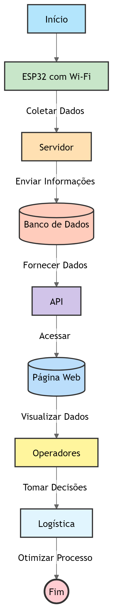

# John_Deere

## Introdução

O projeto Spot foi desenvolvido para solucionar um problema crítico na linha de produção da John Deere: a identificação e gestão de carrinhos kit. Esses carrinhos são responsáveis por transportar materiais essenciais para diferentes etapas da produção, e seu monitoramento em tempo real é fundamental para garantir a eficiência do processo produtivo.

A solução utiliza um ESP32 com Wi-Fi para coletar dados de localização e status dos carrinhos, permitindo que os operadores tenham uma visão clara de onde cada carrinho está e qual seu status, facilitando a logística interna e evitando atrasos ou erros operacionais.

## Links para Repositórios Relacionados

Aqui estão os links para os repositórios relacionados que você pode precisar acessar para configurar ou entender a arquitetura completa do projeto:

1. [Repositório ESP32](https://github.com/Leo-Tanaka/esp32): Este repositório contém o firmware necessário para configurar o ESP32 e conectá-lo à aplicação.
2. [Repositório MongoDB](https://github.com/Leo-Tanaka/esp32-server): Scripts e configurações para rodar e gerenciar o banco de dados MongoDB.
3. [Vídeo do funcionamento do site](https://youtu.be/9FUN8H0Ebfs): Demonstração em vídeo do site em funcionamento.

## Desenvolvimento

### Arquitetura

A solução de monitoramento dos carrinhos kit na linha de produção utiliza a integração de diferentes tecnologias para garantir a coleta, armazenamento e visualização dos dados de forma eficiente. Abaixo está um resumo da arquitetura do sistema:

1. **ESP32 com Wi-Fi**: Coleta dados dos carrinhos em tempo real. O ESP32 possui sensores que monitoram o status e a localização dos carrinhos na linha de produção, enviando os dados via Wi-Fi para o servidor da aplicação web.
2. **Servidor Web (Node.js)**: Recebe os dados do ESP32 e os armazena no banco de dados MongoDB. Também processa esses dados e os disponibiliza para a aplicação web.
3. **Banco de Dados (MongoDB)**: Armazena dados como localização, status e horário de última atualização dos carrinhos, permitindo consultas rápidas e eficientes.
4. **Aplicação Web (HTML, CSS, JavaScript)**: Exibe a localização dos carrinhos em um mapa interativo e permite que os operadores monitorem o status em tempo real.
5. **Front-End**: Responsável por apresentar os dados de forma visual, utilizando gráficos e o mapa interativo. As interações com o back-end ocorrem por meio de chamadas RESTful APIs, que permitem a atualização dos dados sem a necessidade de recarregar a página.
6. **Back-End**: Responsável por processar as requisições do front-end, consultar o banco de dados e atualizar os dados conforme necessário.

### Diagrama de Arquiteura

### Tecnologias Envolvidas

- **ESP32 com Wi-Fi**: Coleta de dados dos sensores.
- **Node.js**: Desenvolvimento do servidor web.
- **MongoDB**: Banco de dados não relacional.
- **HTML, CSS e JavaScript**: Desenvolvimento da aplicação web.
- **draw.io**: Criação dos diagramas da arquitetura do projeto.

## Resultados

Concluimos que a conexão entre o ESP32 e o servidor e o Banco de Dados foi bem sucedida, permitindo a coleta e a transmissão de dados, mas  ainda há um problema de conexão entre o banco de dados com a API do site que impossibilita a visualização dos dados. É um problema a ser resolvido.

## Requisitos

### Hardware

- ESP32 com Wi-Fi
- Sensores (opcional)
- Fonte de energia para o ESP32

### Software

- MongoDB instalado e configurado
- Node.js (opcional)
- Navegador web compatível

## Estrutura de Arquivos

- **Home.html**: Página principal do projeto
- **LoginV2.html**: Página de autenticação
- **Mapa.html**: Página que integra um mapa interativo
- **Status.html**: Página que exibe o status atual dos carrinhos
- **src/**: Diretório que contém os recursos essenciais para o frontend do projeto
- **src/assets/**: Diretório de imagens e arquivos gráficos
- **src/css/**: Diretório das folhas de estilo CSS
- **src/js/**: Diretório dos arquivos JavaScript

## Integração com MongoDB e ESP32

- O projeto se conecta ao MongoDB para armazenar e recuperar os dados coletados pelo ESP32.
- O ESP32 é configurado para enviar dados ao servidor da aplicação web.

### Configuração de MongoDB

- Certifique-se de que o MongoDB esteja instalado e configurado corretamente.
- Configure o banco de dados para armazenar os dados coletados pelo ESP32.

### Configuração do ESP32

- Configure o ESP32 para enviar dados ao servidor da aplicação web.
- Certifique-se de que o ESP32 esteja conectado à fonte de energia.

## Exemplos de Uso

- Monitore o status dos carrinhos em tempo real.
- Visualize os dados coletados pelo ESP32 em um mapa interativo.
- Acesse a página de autenticação para gerenciar os usuários.

## Depuração

- Verifique se o ESP32 está conectado à fonte de energia e ao servidor da aplicação web.
- Verifique se o MongoDB está configurado corretamente.
- Verifique se os arquivos JavaScript e CSS estão carregados corretamente.

## Roadmap

- Implementar funcionalidades de notificação para os usuários.
- Melhorar a interface do usuário.
- Adicionar suporte a múltiplos sensores.

## Contribuições

Contribuições são bem-vindas! Envie um pull request com suas melhorias.

## Contato

Se você tiver alguma dúvida ou precisar de ajuda, entre em contato conosco através do e-mail: brunoferreira.takaya@gmail.com.

## Testes

- Verifique o funcionamento correto executando os testes unitários e de integração.
- Verifique se o ESP32 está enviando dados corretamente ao servidor.

## Créditos

Este projeto foi desenvolvido por:

- Bruno Takaya
- Leonardo Tanaka

